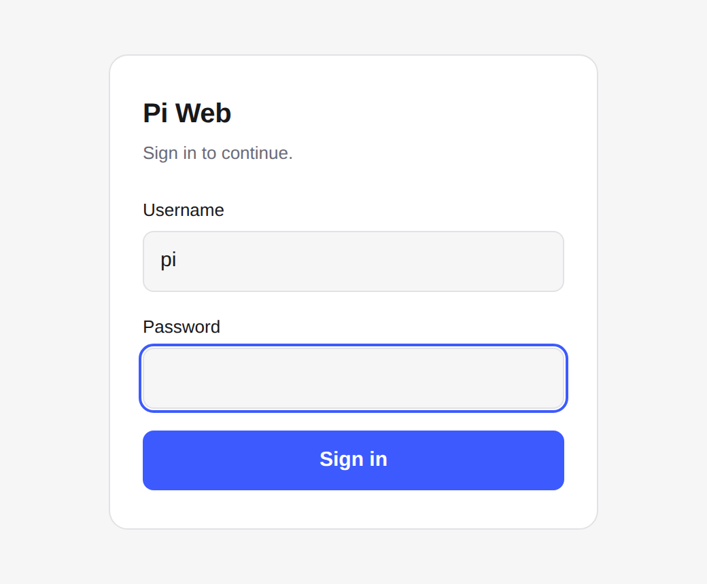
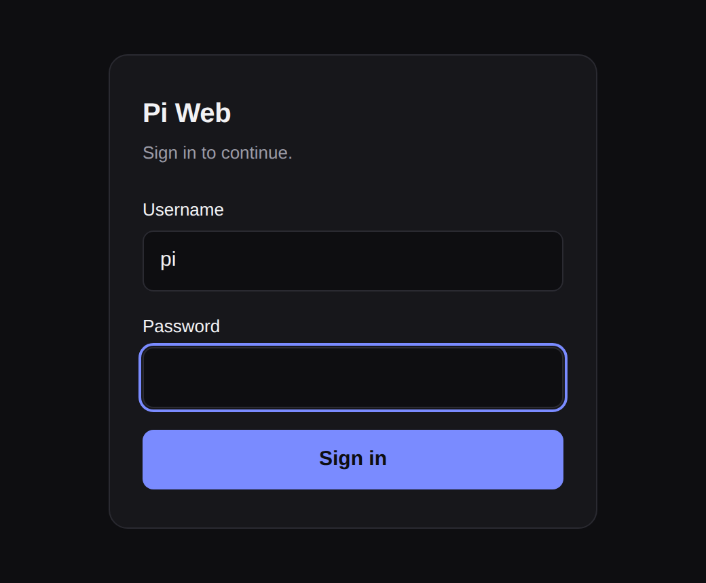
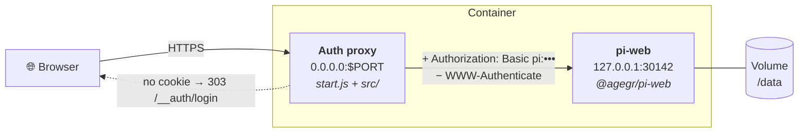

<div align="center">

# CloudAgent

**Run the [Pi coding agent](https://github.com/agegr/pi-web)'s web UI on your own server — with a real login page.**

[](LICENSE)
[](https://nodejs.org)
[](Dockerfile)
[](https://www.npmjs.com/package/@agegr/pi-web)
[](src/auth-proxy.test.mjs)

**English** · [简体中文](README.zh-CN.md)

</div>

---

## What this is

[pi-web](https://github.com/agegr/pi-web) is a web UI for the pi coding agent. It is built for
`localhost`, and its only remote-access story is HTTP Basic Auth — which browsers can render only
as a native credential popup:

```
401 Unauthorized
WWW-Authenticate: Basic realm="Pi Web", charset="UTF-8"
```

That popup cannot be styled, cannot be branded, has no logout, and password managers handle it
poorly. On a phone it is worse.

**CloudAgent puts pi-web on the internet properly.** It runs pi-web on a loopback-only port and
places a small authentication proxy in front of it. You get a normal login page, a session cookie,
and a logout endpoint — in one container that runs anywhere Docker runs.

<div align="center">

&nbsp;&nbsp;

</div>

## Why you might want it

| | |
| --- | --- |
| 🔐 **A real login page** | Styled, theme-aware, mobile-friendly, works with password managers, and has an actual logout. No browser popup, ever. |
| 🧩 **No fork of pi-web** | pi-web is consumed as a published package and keeps auto-updating. Nothing to rebase, no Next.js build to maintain. |
| 🪶 **No added dependencies** | The whole wrapper is ~800 lines of Node standard library. No Express, no `http-proxy`, no session library — pi-web itself is the only dependency, so there is nothing extra to audit or patch. |
| 🛡️ **Defence in depth** | pi-web binds `127.0.0.1` only and keeps its own auth; the proxy injects credentials upstream and gates *every* path, including the static assets pi-web leaves open. |
| ☁️ **Runs anywhere** | One Dockerfile. Railway, Fly.io, Render, Coolify, a Raspberry Pi, or any VPS with Docker. |
| 💾 **Survives restarts** | All agent state lives under one directory — mount a volume and sessions, settings and projects persist across redeploys. |
| ✅ **Tested** | 20 tests, including the proxy end-to-end: redirect behaviour, cookie flags, credential injection, unbuffered SSE, and that `WWW-Authenticate` never escapes. |

## How it works



1. An unauthenticated request for a page is redirected to `/__auth/login`; API requests get a JSON
   `401` instead, so the UI never sees an HTML page where it expects data.
2. The submitted password is compared in constant time, and a signed `HttpOnly`, `SameSite=Lax`
   session cookie is issued.
3. Authenticated requests are proxied upstream with `Authorization: Basic pi:<password>` injected,
   so pi-web's own middleware still guards it.
4. `WWW-Authenticate` is stripped from every upstream response — the popup can never surface, even
   if pi-web answers `401`.

Server-sent events stream through unbuffered, so the agent's token-by-token output stays live.

## Deploy

### Railway

[](https://railway.com/new/template?template=https%3A%2F%2Fgithub.com%2Fbowardzhang%2FCloudAgent)

Point a service at this repository, attach a volume mounted at `/data`, and set `PI_WEB_PASSWORD`
and `PI_WEB_SESSION_SECRET`. The public domain is detected automatically from
`RAILWAY_PUBLIC_DOMAIN`; only a custom domain needs `PI_WEB_PUBLIC_HOST`.

### Docker — any host

```sh
docker build -t cloudagent .

docker run -d --name cloudagent \
  -p 8080:8080 \
  -e PORT=8080 \
  -e PI_WEB_PASSWORD='choose-a-strong-password' \
  -e PI_WEB_SESSION_SECRET="$(openssl rand -hex 32)" \
  -e PI_WEB_PUBLIC_HOST='agent.example.com' \
  -v cloudagent-data:/data \
  cloudagent
```

### Docker Compose

```yaml
services:
  cloudagent:
    build: .
    ports: ["8080:8080"]
    environment:
      PORT: "8080"
      PI_WEB_PASSWORD: "choose-a-strong-password"
      PI_WEB_SESSION_SECRET: "generate-with-openssl-rand-hex-32"
      PI_WEB_PUBLIC_HOST: "agent.example.com"
    volumes:
      - cloudagent-data:/data
    restart: unless-stopped

volumes:
  cloudagent-data:
```

### Other platforms

Anything that builds a Dockerfile works the same way — [Fly.io](https://fly.io/docs/launch/deploy/),
[Render](https://render.com/docs/deploy-an-image), Coolify, Dokku, Kubernetes, or plain
`docker run` on a VPS. Two rules apply everywhere:

- **Mount a volume at `/data`**, or every session and setting is lost on redeploy.
- **Set `PI_WEB_PUBLIC_HOST`** to the hostname users type in the browser. pi-web rejects requests
  whose `Host` header it does not recognise, and only Railway's domain is detected automatically.

Behind a TLS-terminating reverse proxy (Caddy, nginx, Cloudflare Tunnel), forward the original
`Host` and `X-Forwarded-Proto` headers — the first keeps pi-web happy, the second makes the session
cookie `Secure`.

### Local

```sh
npm install
npm test
PI_WEB_PASSWORD=dev PI_WEB_DATA_DIR="$PWD/.data" PORT=30141 npm start
```

## Configuration

| Variable | Default | Purpose |
| --- | --- | --- |
| `PI_WEB_PASSWORD` | — | **Login password.** When unset, the app is served with no authentication at all and a warning is logged. |
| `PI_WEB_SESSION_SECRET` | random per boot | HMAC key for session cookies. Without it, every restart signs everyone out. |
| `PI_WEB_PUBLIC_HOST` | — | Public hostname. Required unless the platform exposes `RAILWAY_PUBLIC_DOMAIN`. |
| `PI_WEB_ALLOWED_HOSTS` | — | Comma-separated hostnames, for multiple domains. |
| `PORT` | `30141` | Public port the proxy binds. Most platforms set this for you. |
| `PI_WEB_DATA_DIR` | `/data` | Agent home and state directory — the path to mount a volume at. |
| `PI_WEB_USERNAME` | `pi` | Username the login form expects. pi-web upstream always receives `pi`. |
| `PI_WEB_SESSION_TTL_HOURS` | `168` | Session lifetime (7 days). |
| `PI_WEB_LOGIN_TITLE` | `Pi Web` | Heading on the login page. |
| `PI_WEB_INTERNAL_PORT` | `30142` | Loopback port pi-web listens on. |
| `PI_WEB_INSECURE_COOKIES` | unset | Set to `1` to never mark the cookie `Secure` (local HTTP testing). |

Rotating `PI_WEB_PASSWORD` invalidates every existing session, because the password is folded into
the cookie signing key.

### Endpoints

| Path | Auth | Purpose |
| --- | --- | --- |
| `GET /__auth/login` | public | The login page. |
| `POST /__auth/login` | public | Submits credentials, sets the session cookie. |
| `POST /__auth/logout` | public | Clears the session cookie. |
| `GET /__auth/healthz` | public | `{"status":"ok"}` — use it as your platform's health check. |
| everything else | session | Proxied to pi-web. |

## Giving the agent GitHub access

The agent can clone, commit and push once git knows your token. Note that git **does not** read
`GITHUB_TOKEN` on its own — it needs a credential helper. Run this once in a pi-web session
(the `!` prefix runs a shell command directly, without a model turn):

```sh
!git config --global credential.https://github.com.helper '!f() { if [ "$1" = get ]; then echo username=x-access-token; echo "password=$GITHUB_TOKEN"; fi; }; f'
!git config --global user.name "Your Name"
!git config --global user.email "you@example.com"
```

Then set `GITHUB_TOKEN` as an environment variable on your platform. The helper reads it at call
time, so the token is never written to disk, and rotating it needs no cleanup. The config lands in
`/data/.gitconfig`, so it applies to every project and every session and survives restarts.

Scope the token narrowly — a fine-grained token limited to the repositories the agent needs, with
an expiry date.

## Security model

CloudAgent is a lock on the door. Understand what is behind the door before you open it to the
internet:

- **The agent executes code.** Anyone who logs in gets shell access inside the container, with
  whatever credentials the container holds. Treat `PI_WEB_PASSWORD` as a root password.
- **Use a long random password**, and always deploy behind HTTPS. Over plain HTTP the password and
  session cookie travel in the clear.
- **The container is the security boundary.** Give it only the tokens it truly needs, and prefer a
  fine-grained GitHub token over a classic one.
- Login attempts are rate limited per client IP (10 failures per 15 minutes), cross-origin form
  submissions are rejected, and `?next=` is restricted to same-origin paths.

Found a security issue? Please open an issue — or report it privately if it is sensitive.

## Development

```sh
npm test          # 20 tests: sessions, redirect safety, and the proxy end-to-end
```

| Path | Contents |
| --- | --- |
| `start.js` | Boots pi-web on the internal port and the proxy on the public one. |
| `src/auth-proxy.js` | HTTP server: routing, auth gate, proxying, SSE and upgrade handling. |
| `src/session.js` | Cookie signing, verification and parsing. |
| `src/config.js` | Environment parsing and public-hostname resolution. |
| `src/login-page.js` | The login page markup. |
| `src/auth-proxy.test.mjs` | Tests, including a live upstream and a real browser-shaped flow. |

Contributions are welcome. Please keep `npm test` green and add a test alongside any behaviour
change.

## Credits

Built on [pi-web](https://github.com/agegr/pi-web) and the
[pi coding agent](https://www.npmjs.com/package/@earendil-works/pi-coding-agent), both MIT
licensed. This repository is an independent deployment wrapper and is not affiliated with their
authors.

## License

[MIT](LICENSE).
