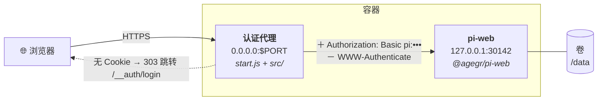

<div align="center">

# CloudAgent

**在自己的服务器上运行 [Pi 编码助手](https://github.com/agegr/pi-web)的 Web 界面 —— 带一个像样的登录页。**

[](LICENSE)
[](https://nodejs.org)
[](Dockerfile)
[](https://www.npmjs.com/package/@agegr/pi-web)
[](src/auth-proxy.test.mjs)

[English](README.md) · **简体中文**

</div>

---

## 这是什么

[pi-web](https://github.com/agegr/pi-web) 是 pi 编码助手的 Web 界面。它是为 `localhost` 设计的，
唯一的远程访问方案是 HTTP Basic Auth —— 而浏览器只能把它渲染成一个原生弹窗：

```
401 Unauthorized
WWW-Authenticate: Basic realm="Pi Web", charset="UTF-8"
```

这个弹窗改不了样式、加不了品牌、没有退出登录，密码管理器对它的支持也很差。在手机上体验更糟。

**CloudAgent 让 pi-web 能体面地跑在公网上。** 它把 pi-web 运行在仅监听回环地址的端口上，前面加一层
认证代理。你得到的是正常的登录页、会话 Cookie 和退出登录接口 —— 打包成一个能在任何 Docker 环境运行的容器。

<div align="center">

&nbsp;&nbsp;

</div>

## 为什么值得用

| | |
| --- | --- |
| 🔐 **真正的登录页** | 有样式、自适应深浅色、手机友好、密码管理器能识别，还有真正的退出登录。永远不会再出现浏览器弹窗。 |
| 🧩 **不 fork pi-web** | pi-web 以官方发布的包引入，继续自动更新。没有分支要同步，也不用维护 Next.js 构建流程。 |
| 🪶 **不引入额外依赖** | 整个封装层约 800 行 Node 标准库代码。没有 Express、没有 `http-proxy`、没有会话库 —— 唯一的依赖就是 pi-web 本身，没有额外的东西需要审计和打补丁。 |
| 🛡️ **纵深防御** | pi-web 只监听 `127.0.0.1` 并保留自身认证；代理向上游注入凭据，并对**所有**路径设防，包括 pi-web 自己没有保护的静态资源。 |
| ☁️ **哪都能跑** | 一个 Dockerfile。Railway、Fly.io、Render、Coolify、树莓派，或任何装了 Docker 的 VPS。 |
| 💾 **重启不丢** | 所有 agent 状态都在同一个目录下 —— 挂载一个卷，会话、设置和项目就能跨重新部署保留。 |
| ✅ **有测试** | 20 个测试，包含代理的端到端验证：跳转行为、Cookie 标志位、凭据注入、SSE 不缓冲，以及 `WWW-Authenticate` 绝不外泄。 |

## 工作原理



1. 未认证的页面请求被跳转到 `/__auth/login`；API 请求则返回 JSON `401`，这样前端不会在期待数据的地方
   收到一个 HTML 页面。
2. 提交的密码以常数时间比较，验证通过后签发带签名的 `HttpOnly`、`SameSite=Lax` 会话 Cookie。
3. 已认证的请求在转发给上游时注入 `Authorization: Basic pi:<密码>`，因此 pi-web 自身的中间件依然在防守。
4. 上游响应中的 `WWW-Authenticate` 一律被剥除 —— 即使 pi-web 返回 `401`，弹窗也不可能出现。

SSE 流式响应不经缓冲直接透传，所以 agent 逐 token 的输出依然是实时的。

## 部署

### Railway

[](https://railway.com/new/template?template=https%3A%2F%2Fgithub.com%2Fbowardzhang%2FCloudAgent)

创建服务指向本仓库，挂载一个卷到 `/data`，然后设置 `PI_WEB_PASSWORD` 和 `PI_WEB_SESSION_SECRET`。
公网域名会从 `RAILWAY_PUBLIC_DOMAIN` 自动识别；只有自定义域名才需要设置 `PI_WEB_PUBLIC_HOST`。

### Docker —— 任意主机

```sh
docker build -t cloudagent .

docker run -d --name cloudagent \
  -p 8080:8080 \
  -e PORT=8080 \
  -e PI_WEB_PASSWORD='设一个足够强的密码' \
  -e PI_WEB_SESSION_SECRET="$(openssl rand -hex 32)" \
  -e PI_WEB_PUBLIC_HOST='agent.example.com' \
  -v cloudagent-data:/data \
  cloudagent
```

### Docker Compose

```yaml
services:
  cloudagent:
    build: .
    ports: ["8080:8080"]
    environment:
      PORT: "8080"
      PI_WEB_PASSWORD: "设一个足够强的密码"
      PI_WEB_SESSION_SECRET: "用 openssl rand -hex 32 生成"
      PI_WEB_PUBLIC_HOST: "agent.example.com"
    volumes:
      - cloudagent-data:/data
    restart: unless-stopped

volumes:
  cloudagent-data:
```

### 其他平台

任何能构建 Dockerfile 的平台用法都一样 —— [Fly.io](https://fly.io/docs/launch/deploy/)、
[Render](https://render.com/docs/deploy-an-image)、Coolify、Dokku、Kubernetes，或者 VPS 上直接
`docker run`。有两条规则到哪都适用：

- **挂载一个卷到 `/data`**，否则每次重新部署，所有会话和设置都会丢失。
- **设置 `PI_WEB_PUBLIC_HOST`** 为用户在浏览器里输入的那个域名。pi-web 会拒绝 `Host` 头不在白名单里的
  请求，而只有 Railway 的域名能被自动识别。

如果前面还有一层负责 TLS 的反向代理（Caddy、nginx、Cloudflare Tunnel），请把原始的 `Host` 和
`X-Forwarded-Proto` 头透传过来 —— 前者让 pi-web 放行，后者让会话 Cookie 带上 `Secure` 标志。

### 本地运行

```sh
npm install
npm test
PI_WEB_PASSWORD=dev PI_WEB_DATA_DIR="$PWD/.data" PORT=30141 npm start
```

## 配置

| 变量 | 默认值 | 用途 |
| --- | --- | --- |
| `PI_WEB_PASSWORD` | — | **登录密码。** 不设置时整站无认证直接可访问，日志里会有警告。 |
| `PI_WEB_SESSION_SECRET` | 每次启动随机 | 会话 Cookie 的 HMAC 密钥。不设置的话每次重启所有人都被登出。 |
| `PI_WEB_PUBLIC_HOST` | — | 公网域名。除非平台提供 `RAILWAY_PUBLIC_DOMAIN`，否则必须设置。 |
| `PI_WEB_ALLOWED_HOSTS` | — | 逗号分隔的域名列表，用于多个域名的场景。 |
| `PORT` | `30141` | 代理对外监听的端口。多数平台会自动设置。 |
| `PI_WEB_DATA_DIR` | `/data` | agent 的 home 和状态目录 —— 也就是要挂卷的路径。 |
| `PI_WEB_USERNAME` | `pi` | 登录表单要求的用户名。上游 pi-web 收到的始终是 `pi`。 |
| `PI_WEB_SESSION_TTL_HOURS` | `168` | 登录有效期（7 天）。 |
| `PI_WEB_LOGIN_TITLE` | `Pi Web` | 登录页上显示的标题。 |
| `PI_WEB_INTERNAL_PORT` | `30142` | pi-web 监听的回环端口。 |
| `PI_WEB_INSECURE_COOKIES` | 未设置 | 设为 `1` 则 Cookie 永不带 `Secure` 标志（仅用于本地 HTTP 测试）。 |

更换 `PI_WEB_PASSWORD` 会让所有已有会话失效，因为密码参与了 Cookie 签名密钥的推导。

### 接口

| 路径 | 认证 | 用途 |
| --- | --- | --- |
| `GET /__auth/login` | 公开 | 登录页。 |
| `POST /__auth/login` | 公开 | 提交凭据，签发会话 Cookie。 |
| `POST /__auth/logout` | 公开 | 清除会话 Cookie。 |
| `GET /__auth/healthz` | 公开 | 返回 `{"status":"ok"}` —— 可作为平台的健康检查。 |
| 其他所有路径 | 需要会话 | 转发给 pi-web。 |

## 让 agent 访问 GitHub

只要 git 知道你的 token，agent 就能 clone、commit 和 push。注意 git **不会**自己去读 `GITHUB_TOKEN`
这个变量 —— 它需要一个 credential helper。在 pi-web 会话里执行一次即可
（`!` 前缀表示直接执行 shell 命令，不经过模型）：

```sh
!git config --global credential.https://github.com.helper '!f() { if [ "$1" = get ]; then echo username=x-access-token; echo "password=$GITHUB_TOKEN"; fi; }; f'
!git config --global user.name "你的名字"
!git config --global user.email "你的邮箱"
```

然后在平台上把 `GITHUB_TOKEN` 设为环境变量。helper 在调用时才去读它，所以 token 不会落盘，更换时也不需要
清理任何文件。配置写入 `/data/.gitconfig`，因此对所有项目、所有会话生效，且重启后依然有效。

token 权限要收窄 —— 建议用 fine-grained token，只授权 agent 真正需要的仓库，并设置过期时间。

## 安全模型

CloudAgent 是门上的锁。在把门朝公网打开之前，请先想清楚门后面是什么：

- **agent 会执行代码。** 任何登录进来的人都相当于拿到了容器内的 shell，以及容器持有的全部凭据。
  请把 `PI_WEB_PASSWORD` 当作 root 密码来对待。
- **用足够长的随机密码**，并且务必部署在 HTTPS 之后。走明文 HTTP 时，密码和会话 Cookie 都是裸奔的。
- **容器就是安全边界。** 只给它真正需要的 token，GitHub 优先用 fine-grained token 而非经典 token。
- 登录尝试按客户端 IP 限流（15 分钟 10 次失败），跨源表单提交会被拒绝，`?next=` 参数被限制为同源路径。

发现安全问题？欢迎提 issue —— 如果比较敏感，请私下报告。

## 开发

```sh
npm test          # 20 个测试：会话、跳转安全性，以及代理的端到端验证
```

| 路径 | 内容 |
| --- | --- |
| `start.js` | 在内部端口拉起 pi-web，在对外端口拉起代理。 |
| `src/auth-proxy.js` | HTTP 服务：路由、认证网关、转发、SSE 与协议升级处理。 |
| `src/session.js` | Cookie 的签名、校验与解析。 |
| `src/config.js` | 环境变量解析与公网域名解析。 |
| `src/login-page.js` | 登录页的 HTML。 |
| `src/auth-proxy.test.mjs` | 测试，包含一个真实上游服务和贴近浏览器行为的完整流程。 |

欢迎贡献代码。请保持 `npm test` 全绿，并为任何行为变更补上对应的测试。

## 致谢

基于 [pi-web](https://github.com/agegr/pi-web) 和
[pi 编码助手](https://www.npmjs.com/package/@earendil-works/pi-coding-agent) 构建，两者均为 MIT 许可。
本仓库是独立的部署封装，与其作者没有隶属关系。

## 许可证

[MIT](LICENSE)。
